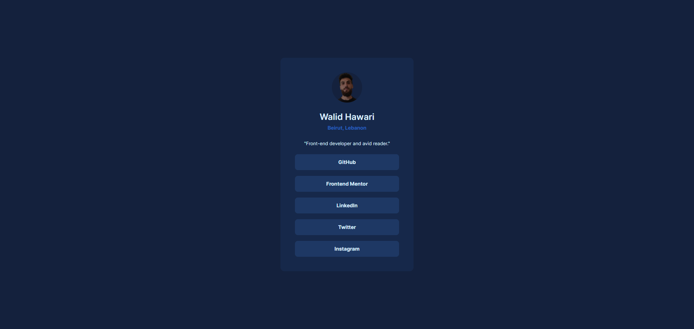

# Frontend Mentor - Social links profile solution

This is a solution to the [Social links profile challenge on Frontend Mentor](https://www.frontendmentor.io/challenges/social-links-profile-UG32l9m6dQ). Frontend Mentor challenges help you improve your coding skills by building realistic projects. 

## Table of contents

- [Overview](#overview)
  - [Screenshot](#screenshot)
  - [Links](#links)
- [My process](#my-process)
  - [Built with](#built-with)
  - [What I learned](#what-i-learned)
  - [Continued development](#continued-development)
  - [Useful resources](#useful-resources)
- [Author](#author)

## Overview

### Screenshot

### Links

- Solution URL: [Social links profile solution](https://github.com/whawari/fm-social-links-profile)
- Live Site URL: [https://whawari.github.io/fm-social-links-profile/](https://whawari.github.io/fm-social-links-profile/)

## My process

### Built with

- Semantic HTML5 markup
- [Tailwind CSS](https://tailwindcss.com/) - Utility-first CSS framework

### What I learned

This project was easy for me. I learned how to use Tailwind's color opacity modifier.

### Continued development

I am currently learning Tailwind CSS, and I plan to continue refining my skills with it for future projects.

### Useful resources

- [Tailwind CSS Cheat Sheet](https://www.creative-tim.com/twcomponents/cheatsheet) - This helped me to quickly find Tailwind CSS classes needed for this challenge. I really liked the simplicity of the cheat sheet and will continue using it until I get a good grasp of Tailwind CSS classes.
- [Tailwind CSS Text Color Docs](https://tailwindcss.com/docs/text-color#changing-the-opacity) - This helped me to learn how to use the color opacity modifier to control the opacity of an element's text/background color.
- [Coolors](https://coolors.co/) - I used this color palette generator to generate a personalized color for this project. 
- [Tailwind CSS Color Generator](https://uicolors.app/create) - I used this color generator to create a custom color scale.

## Author

- Frontend Mentor - [@whawari](https://www.frontendmentor.io/profile/whawari)
- Linkedin - [@walid-hawari](https://www.linkedin.com/in/walid-hawari/)
